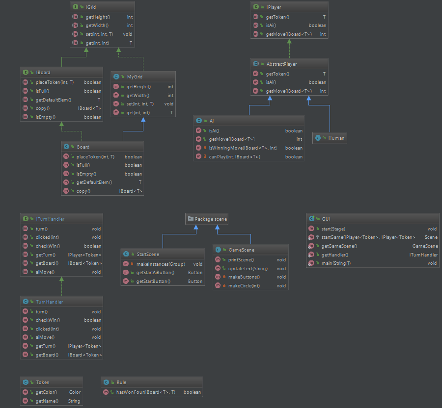

# [Semesteroppgave 2: “Fire på rad”](https://retting.ii.uib.no/inf101.v18.sem2/blob/master/SEM-2.md)

* **README**
* [Oppgavetekst](SEM-2.md)

Dette prosjektet inneholder [Semesteroppgave 2](SEM-2.md).

   
# Fyll inn egne svar/beskrivelse/kommentarer til prosjektet under
* Levert av: Daniel Berge (dbe015)

* Sjekkliste:
   * [x] Kjørbart Fire på Rad-spill
   * [x] Forklart designvalg, hvordan koden er organisert, abstraksjon, og andre ting 
   * [x] Tester
   * [x] Dokumentasjon (JavaDoc, kommentarer, diagrammer, README, etc.)
   * [x] Fornuftige navn på klasser, interfaces, metoder og variabler
   * [x] Fornuftige abstraksjoner og innkapsling (bruk av klasser, interface, metoder, etc.)

## Oversikt
*(oversikt over koden din og det du har gjort)*

### Bruk
* For å starte programmet kjør: [GUI](src/gui/GUI.java)

## Designvalg
*(hvordan du har valgt å løse oppgaven)*

Har brukt JavaFx til å lage GUI, der man kan velge om man vil spille mot en annen person eller spille mot en AI.
Har brukt CSS for å lage pene knapper for startmenyen. Og for å skjule knappene i selve spillet.
Har laget spillet ganske modulært, det er mange klasser, som er navngitt så det er lett å forstå hva de gjør. Kunne hatt mindre klasser, men da hadde det ikke vært like modulært.

### Bruk av abstraksjon
*(hvordan du har valgt objekter/klasser for å representere ting i spillet)*

Har brukt innkapsling så de metodene som ikke skal kalles fra alle steder er enten private eller protected.

De fleste av klassene er generiske så gjenbruk av klassene er lett. 
TurnHandler klassen er ikke generisk, fordi den bruker mange metoder fra Token, kunne kanskje gjort det på en annen måte, men frister ikke, for det er ikke så viktig at den er generisk, for den er ganske spesifik for dette spillet.

Har brukt en abstract class til players. Der både Human og Ai extends Abstractplayer, fordi disse skal ha mange av de samme metodene og de samme feltvariablene.

Har interfaces for de fleste klassene, der det er relevant. Disse er godt kommentert, så det er lett å forstå hva de gjør.
