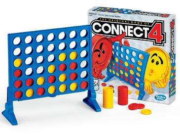

# [Semesteroppgave 2: “Fire på rad”](https://retting.ii.uib.no/inf101.v18.sem2/blob/master/SEM-2.md)

* [README])(README.md) – for utfylling
* [Oppgavetekst](SEM-2.md)

## Læringsmål
- Å få erfaring med å ta egne designvalg, i stedet for å bare følge en oppskrift.
- Å utarbeide programmer og tester på egenhånd.
- Å beskrive design og lage dokumentasjon.

## Spillet
I denne oppgaven skal du lage spillet [fire på rad](https://en.wikipedia.org/wiki/Connect_Four). 



Fire på Rad spilles av to spillere. Dersom du spilte det når du var liten, husker du kanskje at du starter med en tom, stående plastramme med adskilte kolonner der man kan slippe brikker ned fra toppen, og hver sine brikker av forskjellig farge (f.eks. rød og gul). Spilleren som starter slipper en brikke med sin farge ned i en valgfri kolonne på spillrammen. Neste spiller gjør det samme, og spillet fortsetter slik til en av spillerne har fått fire brikker på rad, loddrett, vannrett eller diagonalt, og dermed vinner spillet.


Du skal lage et program for å spille Fire på Rad. Du velger selv hvordan du vil lage brukergrensesnitt, hva du vil kalle klassene dine og hvordan du vil organisere koden. Du får utlevert et tomt Java-prosjekt som du skal levere programmet i. Forøvrig står du fritt til å utvikle prosjektet som du vil, men du vil få poeng (fra 0-100) ut ifra hvor godt du har brukt det du har lært i INF101. Vi kommer til å hjelpe deg med en plan for hvordan du kan legge opp arbeidet, noen tips til ting som er lurt å tenke på, og forslag til hvordan du kan gjøre oppgaven mer spennende.

*Husk at du kan spørre om hjelp og tips underveis!* Gruppelederne hjelper deg gjerne om du lurer på noe, er usikker på om det du har gjort er lurt, eller om du blir stående fast. Det er meningen at du skal få det til – vi lar deg starte fra grunnen av for at du skal få erfaring med det, og ikke fordi vi skal teste at du kan “alt”.

## Innleveringen
Sjekk ut koden fra:

    https://retting.ii.uib.no/<brukernavn>/inf101.v18.sem2.git
   
(Husk å bytte ut `<brukernavn>` med brukernavnet ditt.) Her ligger oppgaveteksten og et tomt Java-prosjekt. Du skal utvikle programmet ditt i dette prosjektet, og pushe til repositoriet ditt slik som før. Når vi retter oppgaven din kommer vi til å se etter:

* Et kjørbart Fire på Rad-spill som vi kan spille alene (mot en AI) eller mot et annen, ekte spiller
* [README-fil](README.md) som forklarer designvalg, hvordan koden er organisert, abstraksjon, og andre ting vi bør vite om koden din. 
* Tester
* Dokumentasjon (JavaDoc, kommentarer, diagrammer, README, etc.)
* At navn på klasser, interfaces, metoder og variabler er fornuftige
* Fornuftige abstraksjoner og innkapsling (bruk av klasser, interface, metoder, etc.) – forklart i README

Du må gjerne (!) diskutere oppgaven med andre, men dere må skrive individuell kode. Dersom du samarbeider tett med noen så beskriv det i README-filen. 

TODO: review

## Programmet
Målet med oppgaven er å skrive et spillbart program for 1-2 spillere, av Fire på Rad. Krav til programmet ditt er at: 

* Det er spillbart, ut ifra [reglene](#reglene) til det tradisjonelle Fire på Rad. 
* Det har et [brukergrensesnitt](#brukergrensesnitt): programmet skal kunne brukes av 1-2 "ekte" spillere, f.eks. du og gruppelederen din. For å kunne spille må kunne gi input til programmet, f.eks. ved hjelp av `Scanner`-objekt og `System.out.println`, eller ved hjelp av taster og grafikk eller et klikkbart grafisk grensesnitt. Dette er også den delen av programmet som viser hvordan brikkene er stilt opp og om noen har vunnet enda. 
* Det er spillbart for kun én spiller: det vil si at du må ha en AI-spiller. Den trenger ikke være særlig intelligent, det holder at den gjør tilfeldige gyldige trekk. 
* Koden din viser tydelig, ved hjelp av objekt-orientering, klassenavn, interfaces, metodenavn og feltvariabler hvordan du har [abstrahert Fire på Rad-spillet](#spill-abstraksjon). Beskriv dette gjerne utfyllende i README-filen. 

## Poeng/karakter
Hvor mange poeng du får på oppgaven kommer an på hvor god løsningen din er. Fire på Rad er et relativt enkelt spill å implementere, og det *kan* gjøres i én fil uten klasser og metoder (i INF100-stil). Dersom du løser oppgaven på denne måten vil du få tilnærma 0 poeng. Vi forventer så klart at programmet oppfører seg ca som det skal, men for å få god uttelling på poenget må du i tilegg vise at du kan bruke objekt-orientering på en god måte, og at du kan teste og dokumentere koden din. ***Det er bedre å levere en oppgave som har høy kvalitet på koden og et par bugs, enn et spill som kjører korrekt, men har rotete kode med dårlig inndeling i klasser og manglende dokumentasjon!***

Vi forventer at programmet kjører, du har klasser for fornuftige deler av spillet (se under) og disse er dokumentert og testet og fungerer sammen. Dersom det er mangler i oppgaven vil vi trekke mindre for dem dersom du kan forklare dem og hva som er problemet / hvordan du ville løst det i README-filen din. Dette gjelder også designvalgene – hvis du oppdager at du har gjort dumme valg, hjelper det at du forklarer erfaringen og hvordan du ville gjort det annerledes, selv om du ikke ikke har tid til å fikse implementasjonen.

## Code Review / Feedback på hverandres kode

*Dette er frivillig, men kan være både lærerikt og hjelpe deg til å forbedre innleveringen din.*

Det er veldig nyttig å måtte [forklare](https://en.wikipedia.org/wiki/Rubber_duck_debugging) hvordan man selv har tenkt og hvordan ens egen kode virker, og det er også veldig nyttig å prøve å sette seg inn i hvordan andre har tenkt når de har programmert. Vi anbefaler derfor at du finner går sammen med noen andre studenter (f.eks. i grupper på 2–4 personer) og gjør litt [lightweight](http://codingsight.com/lightweight-code-review/) [code reviews](https://en.wikipedia.org/wiki/Software_peer_review) av hverandres kode:

* Det er praktisk å gå gjennom ting muntlig: sitt rundt samme datamaskin, og forklar din egen kode til de andre (eller prøv å forstå og forklare noen andres kode!) – dere kan diskutere gode og dårlige løsninger, ideer til ting som kan gjøres annerledes eller forbedres osv.
* Du kan også gi tilgang til repositoriet [slik du lærte i Lab 4](https://retting.ii.uib.no/inf101.v18.oppgaver/inf101.v18.lab4/blob/master/LAB-4-I_GIT.md#11-tilgang), og så kan dere prøve lese (og eventuelt kjøre) hverandres kode, og f.eks. gi tilbakemeldinger gjennom *Issues*-systemet i GitLab.
* **Viktig:** poenget med dette er å lære, og å forbedre innleveringene – for at det skal funke er det viktig å være positiv og konstruktiv når du gir tilbakemeldinger eller kommentarer (ellers er det ingen som tør å vise deg koden sin neste gang!)
* Det burde passe greit å gjøre dette en gang i løpet av den første uken, og så en gang til noen dager før innlevering. 
* Det er et eget punkt i [README-filen](README.md) som dere kan krysse av hvis dere prøver dere på en eller annen variant av “code review” – skrive gjerne også noen setninger om hva dere gjorde og hvordan det fungerte (lærte du noe? forbedret du noe?)

## Design – Programmet sine deler

Videre i denne teksten beskriver vi typiske deler av programmet. Dersom du vil dele programmet ditt opp på en annen måte er helt greit: men ***forklar abstraksjonene dine i README-filen, uansett hva du velger å bruke***. Det er viktig at vi skjønner hva du har tenkt, og hvis noe er rart i koden din, kan en god forklaring redde deg fra unødig trekk. Se f.eks. forklaringene du har fått på utlevert kode tidligere for eksempler.

Hver del av programmet bør være så adskilt som mulig fra resten av koden. De kan f.eks. gjerne ligge i hver sine pakker, og prøv at de ikke kaller hverandre unødig mye. Les mer om [modulær](#modulær) kode under [Ekstra](#ekstra). 

### Kjernen av programmet 
Programmet trenger en kjerne, som kontrollerer programflyten. Dette vil typisk være en klasse som knytter sammen de øvrige delene og som har en løkke der hver gjennomkjøring er én spillers runde. Les de neste seksjonene og kikk gjerne på koden fra Semesteroppgave 1 før du bestemmer deg for hvordan å sette opp ditt program. 

## Spill-abstraksjon
De fleste spill består av cirka de samme delene: 

* Spill eller Game
* Spiller eller Player
* Brikker, Piece eller andre "ting" man bruker til å spille med
* noen spill har et Brett eller Board 

Se gjerne på tidligere lab-oppgaver og forrige semesteroppgave for typisk oppsett. 

I tillegg kan vi dele spillere opp i AI-spillere og en abstraksjon av den "ekte" spilleren. AI-spillere har gjerne sin egen måte å bestemme oppførsel på (slik som Rabbits i oblig 1), mens "ekte" spillere må kunne ta imot kommandoer fra en spiller i den virkelige verden. 

Vi kan også skille ut Regler fra selve Spillet. Det er litt mer komplisert, men kan være veldig nyttig: da kan man enklere gjenbruke koden i resten av spillet selv om man vil bytte reglene til å f.eks. spille Fem på Rad eller Fire i Firkant. I så fall er det nyttig å tenke at vi har

* Spill, som har blant annet 
 * [Regler](#regler), som har blant annet
   	 * [Win conditions](#win-conditions), som beskriver nøyaktig hva som må være oppfylt for å vinne spillet. 

I følgende seksjoner beskriver vi de forskjellige delene av spillet, dersom vi bruker denne inndelingen. 

### Brettet og objekter på det
"Spillet" er ofte en samle-klasse for brett og regler. Brettet kan gjerne inneholde spillbrikker, og spillbrikkene kan ha hver sin farge. Dersom du vil bruke et tekst-grensesnitt kan du representere hver farge med f.eks. en bokstav. 

Dersom du ser på brettet i det vedlagt bildet, ser du at selv om brettet står på høykant og har runde hull, så er de viktigste egenskapene for spillet at det har en "Grid"-fuksjonalitet. Det gjør at vi kan tenke på brettet som en to-dimensjonal liste om vi vil, eller som en Grid, slik vi allerede har brukt i oblig 1. Du kan bruke interfaces og klasser fra de tidligere oppgavene og din egen kode - men les dokumentasjonen godt, og endre kode eller kommentarer der du ser at det trengs. Dersom du vil bruke IGrid-interfacet, er det praktisk å bruke en av de senere utgavene som er generisk, slik at du kan ha et grid av brikker.

## Brukergrensesnitt
Brukergrensesnittet er den delen av programmet som tar imot input fra "ekte" spillere (f.eks. du og gruppelederen din) og viser et output fra programmet. Typiske input er klikk-events eller streng-kommandoer; typiske output er å tegne brettet på i et grafikk-vindu eller ved hjelp av tegn og bokstaver i en terminal, og å fortelle spillerne hvem sin tur det er og om noen har vunnet. 

Du trenger ikke å lage et grafisk brukergrensesnitt, det holder med tekst-interaksjon. Det viktige er at denne delen av koden din er klart skilt ut fra resten og godt dokumentert. 

Hvis du vil sjekke om du har klart å skille koden for brukergrensesnittet klart fra resten (vi kaller det "modulær" kode) så kan du prøve å bytte ut brukergrensesnittet ditt med noen annens: dersom du har et fornuftig API til resten av programmet ditt bør det være relativt enkelt å koble noen andres brukergrensesnitt til resten av koden din, og på den måten endre én del av programmet uten å måtte endre kode som ikke har med input/output å gjøre. Du kan nok ikke bytte ut klassene direkte, men det bør gå an med litt jobb, og hvis dere blir enig om en lur måte å skrive interfacene på som dere har felles, kan dere bytte moduler uten å endre øvrig kode. 

*Det er ikke et krav for oppgaven å bytte kode med andre studenter, men hvis du får det til uten særlig mye arbeid ligger du sannsynligvis godt an.* 

### Tips til brukergrensesnitt
Du kan f.eks.
* ...bruke konsoll-I/O slik som i INF100, med `Scanner` og `System.out.println()`.
* ...kopiere grafikkbiblioteket vi har brukt i INF101, f.eks. fra [Semesteroppgave 1](https://retting.ii.uib.no/inf101.v18.oppgaver/inf101.v18.sem1/tree/master/src/inf101/v18/gfx). Grafikken kan tegnes som tekst (slik som i semesteroppgaven, og liknende til `System.out`), eller med skilpaddegrafikk eller shapes – se f.eks. hvordan endene er tegnet i [Lab 6](https://retting.ii.uib.no/inf101.v18.oppgaver/inf101.v18.lab6/blob/master/src/inf101/v18/pond/Duck.java).
* ...kopiere den klikkbare grid-GUIen fra [ekstraoppgaven om lyttere](https://retting.ii.uib.no/inf101.v18.oppgaver/inf101.v18.xtra.listeners); denne har vært brukt på tidligere INF101-obliger også.
* ...bruke [Swing](https://docs.oracle.com/javase/tutorial/uiswing/components/index.html) eller [JavaFX](https://docs.oracle.com/javase/8/javafx/get-started-tutorial/jfx-overview.htm) til å lage brukergrensesnitt (kan ta litt tid å sette seg inn i). Se f.eks. [JavaFX 8 GUI Tutorial](https://code.makery.ch/library/javafx-8-tutorial/)

## Regler
Regler for Fire På Rad:

* Spillere har hver sine brikker (f.eks. med forskjellige farger eller symboler)
* Spillere har hver sin tur til å legge ned brikker 
* På sin tur skal spilleren velge en kolonne å slippe sin brikke ned i.
* (Implisitt regel: en brikke som slippes ned i en kolonne faller til den lander enten oppå en annen brikke eller på bunnen av brettet. Dette er ikke beskrevet i Fire på Rad-spillregler, men er en konsekvens av designet på brettet. Dere velger selv om dere vil vise det grafisk eller ikke, men det er viktig at ikke brikken blir liggende på toppen av kolonnen som er valgt, eller at spilleren får velge x og y-koordinater å legge brikken sin på.)
* Spillet stopper når en spiller vinner, ved å få *fire brikker ligger på rad, enten vannrett, loddrett eller diagonalt*. Dette kravet kalles ofte en [win condition](#win-condition) eller "victory condition": denne betingelsen må være oppfylt for at spillet skal være vunnet.


### Spillere
En ekte spiller (f.eks. du eller gruppelederen din) trenger en intern representasjon i programmet. Dette er abstraksjon av den ekte spilleren, så tenk over hva som har betydning å ha med. La deg gjerne inspirere av Player-klassen fra oblig 1.

I tillegg til en vanlig spiller, må du kunne lage AI-spillere. Bruk gjerne et Spiller-interface som begge disse typene implementerer, og kanskje en felles superklasse dersom de ser ut til å dele oppførsel. Eventuelt kan AI-spiller arve fra Spiller. Vurder selv hvordan du vil gjøre det, og begrunn valget ditt. 

### Win Conditions
Du vinner spillet ved å ha fire brikker på rad: vannrett (-), loddrett (|) eller diabonalt(/ \).

Man kan tenke seg at en annen versjon av spillet der man velger andre regler. Derfor ønsker vi å ha reglene innkapslet i en egen klasse; f.eks. ved at den har en metode som ser på et brett og avgjør om noen har vunnet. Dette gjør programmet mer modulært, og gjør at vi enklere kan gjenbruke resten av programmet til å lage spillet Fem på Rad, kun ved å bytte ut én objekt-type. Du trenger ikke lage Fem på Rad (enda), men du må lage en egen klasse for reglene slik at vi lettere kan utvide spillet dersom vi ønsker det. 

## Ekstra tips 

### Tips for å komme i gang
Vi har to forslag til hvordan du kan angripe oppgaven. 

Enten kan du tenke over hva som er essensielle egenskaper ved Fire på Rad, og hvordan du kan representere dem abstrakt. Du kan finne ut hvilke interfaces og klasser du tror du trenger, hvilke metoder og feltvariabler, og kanskje skrive tester for disse. Deretter kan du implementere abstraksjonen ("modellen") din. Se [modellerings-delen](https://retting.ii.uib.no/inf101.v18.oppgaver/inf101.v18.sem1/blob/master/SEM-1_DEL-A.md#oversikt-modellering) av Sem1 Del A for et eksempel til hvordan du kan gjøre og beskrive dette.

Eller, så kan du skrive et fungerende monster-program i en eller to klasser, få det til å fungere, og deretter splitte det opp ([refaktorere](https://en.wikipedia.org/wiki/Code_refactoring)) til flere klasser, flere metoder, osv. 

Du kan også gjøre en miks av disse to tilnærmingene.

### Tips for kjerne-programmet 
Det er ofte forvirrende at vi må tenke på Spill som en abstraksjon av Fire på Rad (med brett, brikker og spillere), og på main-metoden i et program. Da kan det være nyttig å bruke to forskjellige klasser til det, feks en Main-klasse som starter programmet og initialiserer et Spill-objekt, og en Spill-klasse som er abstrakt og logisk og ikke har noen main-metode. 

Dersom Main og Spill er hver sine klasser, og du ønsker å implementere runder i en løkke, kan det være vanskelig å finne ut hva som skal skje hvor. For å hjelpe deg videre her, kan det være nyttig å sette seg med penn og papir og skrive ned: 

* nøyaktig hva skjer i løpet av en runde?
* hva har alle runder til felles? 
* hva er annerledes under en AI-runde i forhold til en menneske-runde?
* hva skjer når spillet starter, men ikke hver runde?

Siden alle runder (hver spiller sin) likner på hverandre, og alle hele spill (fra start til slutt) likner på hverandre, er det typisk at man lager en løkke for hver, og legger dem inni hverandre: 

```java
main(){
loop until program should stop {
 gjør ting som har med initialisering av spill-objekter;
 loop per single game { 
  gjør ting som trengs for å starte spillet; 
  loop per round { 
   gjør ting som trengs per runde;
  }
 }
}
```

Vi skriver loop og mener en eller annen form for løkke (for, while, do-while): hvordan du vil skrive det finner du ut av selv (eller spør gruppelederen din). Dette er et godt sted å bruke Iteratorer. 

### Tips til bruk av INF101-konsepter
***Dette er ikke en sjekkliste du må oppfylle, og den er ikke komplett.*** Dette er en liste av INF101-konsepter som kan være nyttige og tips til hvordan å bruke dem. Du må sikkert bruke ting som ikke står på listen, og du kan gjerne la være å bruke ting fra listen dersom det ikke passer i koden din. 

* **Interfaces**. Det er naturlig at du bruker interface til å definere oppførselen til klassene dine. Der du kan bør du bruke interface-typen i stedet for klasse-typen. *Det gjør programmet ditt mer modulært og enklere å bytte ut kode.*
* **Arv**. Der du ser at objekter eller klasser deler oppførsel eller kode, kan du gjerne prøve å få til *gjenbruk av kode*. Det kan du gjøre ved at den ene arver fra den andre, eller at koden legges i en felles hjelper-klasse, eller abstrakt klasse. *Unntaket er hvis det bryter med abstraksjonen, altså virker ulogisk og rart.* 
* **Factory**. Dersom du trenger å lage mange objekter av en klasse, eller du trenger veldig typiske objekter med mange ganger, kan det være praktisk å legge inn en Factory. Dersom du oppretter objektene bare av og til, og det er kun et konstruktør-kall som skal til, er det ofte ikke vits å bruke fabrikker. Men hvis oppretting av objekter fører til at du må legge inn "boilerplate" kode, at du gjentar f.eks. if-setninger for fargevalg, eller liknende, er det nyttig å legge det inn i en Factory. 
* **Tester**. Test koden din så godt du kan. Se tidligere oppgaver for tips til hvordan. 
* **Forkrav**. Legg inn forkrav i metoder og konstruktører der det er nyttig. 
* **Datainvariant**. Legg gjerne inn datainvariant (sjekk på at feltvariablene har en gyldig kombinasjon av verdier) i klassene dine der du kan. Det vil hjelpe deg med debugging og regnes som en del av dokumentasjonen. 
* **Datastrukturer**. Se Grid fra tidligere oppgaver. 
* **Generisk type**. Datastrukturen din bør være generisk, og kanskje andre deler av programmet. 
* **Iterator**. Du kan bruke iteratorer på mange måter her: du kan iterere over spillerne i runde-løkken; du kan iterere over brikker på brettet for å sjekke om noen har vunnet (det kan være litt vanskelig å implementere sånn); du kan du kan lagre tidligere spill og iterere over dem for å produsere en total poengsum; osv. 
* **Enum?** Det er ikke sikkert du trenger enums, men de kan ofte være hendige (kanskje for brikker?)
* **Klassediagram**. Tegn gjerne et diagram over koden din. Det er veldig nyttig for din egen del, og gjerne også for gruppelederne. 
* ***Abstraksjon***. Se egen seksjon.
* ***Innkapsling*** eller encapsulation. Pass på at du bruker private modifiers der du kan, og at du gjemmer vekk så mye som mulig av den indre tilstanden til klassene (feltvariabler, nøyaktig implementasjon). Det er nyttig å bruke interfaces til dette. 


## Ekstra utfordringer
Dette er ikke krav til innleveringen, men forslag til videreutvikling. 

### Random Events
To mix things up a litte, the implementation can support the functionality of random events: These events are executed in each round with a certain probability and change the state of the game. Examples are the following (but it can be anything fun, be creative!):

- Throwing 'blocker' tokens into a random column that keep both players to throw their tokens there.
-  Looking at each token in the board and switching its owner with a certain probability. (I.e. some of the blue tokens become red and vice versa.)
-  Switching the owners of tokens in a random (small) area of the board.
-  Rotating the board.
-  ...


### Modulært 
Dersom du skriver programmet ditt modulært, er det lett å koble dine moduler sammen med andres og på den måten f.eks. bytte ut ditt brukergrensesnitt med noen andre sitt, eller koble noen andre sin AI til ditt spill. For å få dette til må du ha god enkapsulering, fornuftig navngiving og forståelig dokumentasjon. Husk at tester er en del av dokumentasjonen. 

For å få programmet modulært må det bestå av flere komponenter eller deler, der hver del implementeres separat fra kjerneprogrammet. Dette betyr ikke at dere trenger forskjellige prosjekter, men at kode-komponenter er klart adskilte (funksjonalitet for AI skal være begrenset til AI-modulen og ikke "lekke" inn i I/O-modulen. Spillets funksjonalitet og regler må ikke påvirkes av at man bytter ut modulen for I/O, osv. 

Siden vi ikke har gitt dere noen interface eller API å følge, er det usannsynlig at du har nøyaktig samme APIer som andre studenter. Derfor må dere nok jobbe litt for å koble modulene deres sammen. En måte å gjøre det på, er å skrive en "koblings-klasse" som oversetter mellom interfacene deres. Den må dere gjerne skrive sammen. Dette blir altså en ny klasse, som ikke finnes i noen av programmene fra før, og som har som jobb å "oversette" mellom forskjellige APIer. Det gjør at dere slipper å endre deres egen kode. 

Eventuelt kan dere bli enige om et felles interface, en *standard*, og følge denne begge to. 

Dersom du samarbeider med noen for å få dette til, skriv i README-filen hvem og hvordan. 

### Bedre AI 
AI-spilleren kan gjøres smartere på mange måter. Du kan finne på dine egene strategier, f.eks. ved å ha en egen klasse for Strategi, og la AI-spillere spille mot hverandre. Hvis du gjør modul-delen over kan du la din AI-spiller konkurrere mot andres. 


### Langton's Fire på Rad
Dersom du likte Langton's Ant fra ukesoppgaven, kan du slå sammen disse oppgavene. Da kan du la maur spille Fire på Rad mot hverandre, ved hjelp av celleautomat-regler. Dette er en litt annen form for AI, og blir nok litt vanskelig å implementere :) 